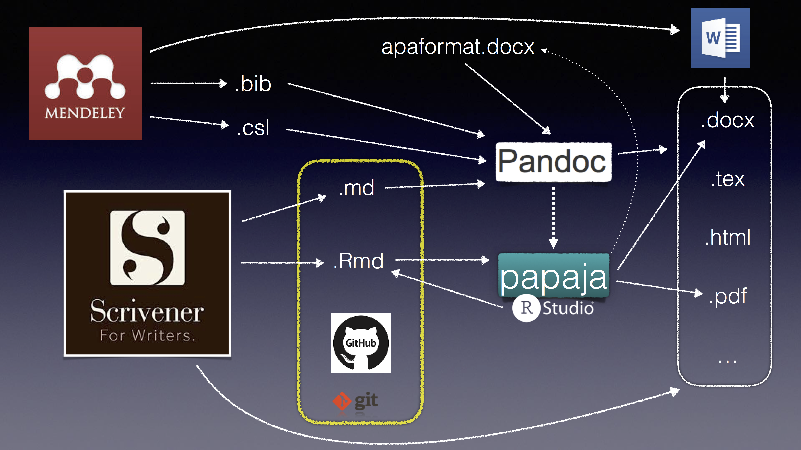

# My Writing Workflow
## markdown, pandoc, and more!

# In this repository
* You will find examples of converting markdown (`.md`) or Rmarkdown (`.Rmd`) files into APA-formatted, publication-ready documents (e.g., `.docx`, `.pdf`, `.tex`), using `pandoc` or `papaja`.

* Specific instructions can be found in `example_pandoc.md` and `example_papaja.Rmd`

* `APA_template.docx` is modified from the template provided by `papaja`

* `APA_ML.csl` is modified from the `apa.csl` obtained from _Zotero_ (https://www.zotero.org/styles/apa), such that **in press** articles can be correctly cited with _Mendeley_.
	* Enter **in press** in the `Short title` field in _Mendeley_, which is equivalent to the `shorttitle` variable in `.bib` files
	* Note: If references are not managed via _Mendeley_, the regular `apa.csl` can be used with the `status` variable specified as **in press** for a given entry in `.bib` files

* See `example.bib` for ways to specify different types of manuscripts, including:
	* published journal articles
	* published books
	* published book chapters
	* in press manuscripts
	* manuscripts submitted for publication
	* unpublished manuscripts
	* master's theses or doctoral dissertations

# Useful links
## reference management
* Mendeley: https://www.mendeley.com/
* BibTeX (.bib): http://www.bibtex.org
* Citation Style Library (.csl): http://citationstyles.org/

## text editing
* interface
	* Scrivener: https://www.literatureandlatte.com/scrivener/overview  
	* vim: https://www.vim.org/
	* vimwiki: https://github.com/vimwiki/vimwiki
	* MacDown: https://macdown.uranusjr.com/
	* R Studio: https://www.rstudio.com/
* filetypes
	* Markdown (.md): https://www.markdownguide.org/ 
	* Rmarkdown (.Rmd): https://rmarkdown.rstudio.com/ 

## file conversion / formatting
* pandoc: https://pandoc.org/ 
* scrivomatic: https://github.com/iandol/scrivomatic
* R Studio
	* papaja: https://github.com/crsh/papaja 
	* bookdown: https://bookdown.org/yihui/bookdown/

## version control
* git: https://git-scm.com/ 
* github: https://github.com/
* hub: https://github.com/github/hub
* tig: https://github.com/jonas/tig
